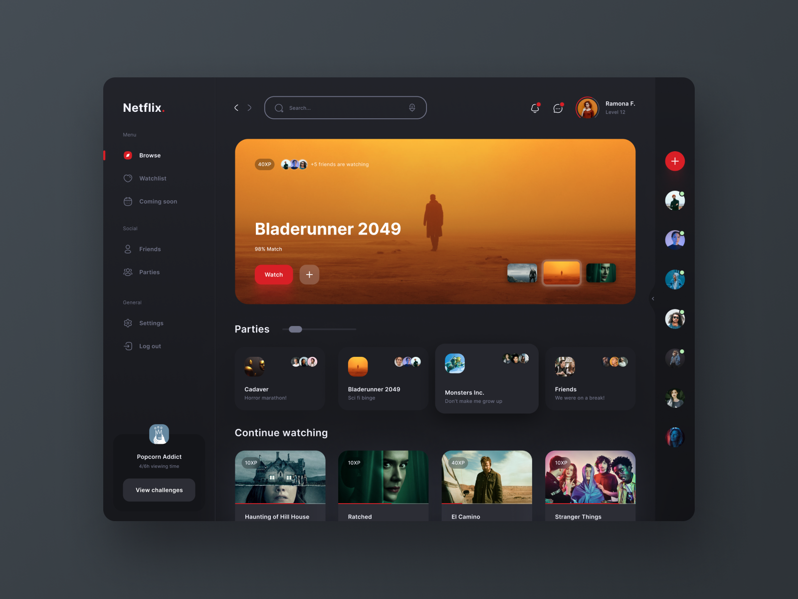

<h1 align="center"> Netflix Gamified </h1>

    Programa promovido por Isaías Ramos para o ensino de tecnologias.  

  <a href="#-tecnologias">Tecnologias</a>&nbsp;&nbsp;&nbsp;|&nbsp;&nbsp;&nbsp;
  <a href="#-layout">Layout</a>&nbsp;&nbsp;&nbsp;&nbsp;&nbsp;&nbsp;

 

  

## 🚀 Tecnologias

Esse projeto foi desenvolvido com as seguintes tecnologias:

- HTML e CSS
- Git e Github

## 🔖 Layout

Você pode visualizar o autor da imagem através [DESSE LINK](https://dribbble.com/shots/15591899-Netflix-Gamified).

---
